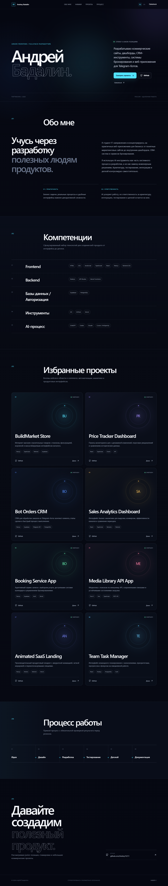
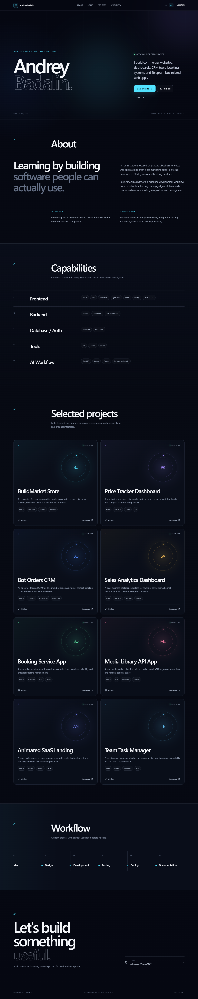

# Andrey Badalin Portfolio


A bilingual developer portfolio presenting eight production-oriented frontend case studies. It combines localized content, responsive layouts, typed project data, and direct links to live demos and source repositories.

## Live Demo

https://andrey-portfolio-liard.vercel.app

## Source Code

https://github.com/Andrey15211/andrey-portfolio

## Features

- Eight portfolio case studies covering commerce, dashboards, CRM, booking, APIs, animation, and task management
- Responsive desktop, tablet, and mobile layouts
- Localized metadata, navigation, project content, and accessibility labels
- Static locale routes and reusable typed content
- Reduced-motion support and keyboard-visible focus states

## Tech Stack

- Next.js 16 App Router
- React 19
- TypeScript
- Tailwind CSS 4
- next-intl
- Lucide React
- Vercel

## Localization

- RU/EN support: complete interface localization
- Default language: Russian (`/ru`)
- Language switcher: available in the desktop header and mobile menu
- English route: `/en`

## Screenshots

### Desktop



### Mobile

Planned path: `docs/screenshots/mobile.png`

### RU/EN example



Mobile screenshot will be added after final device-width capture.

## Local Development

```bash
npm install
npm run dev
npm run build
```

Open `http://localhost:3000`; the root route redirects to `/ru`.

## Deployment

Deployed on Vercel with the standard Next.js preset. The project does not require environment variables.

## What this project demonstrates

- Commercial frontend presentation
- Localized App Router architecture
- Responsive portfolio and case-study design
- Typed content modeling
- Accessible, production-oriented frontend delivery

## Recommended GitHub Topics

`portfolio` `nextjs` `react` `typescript` `tailwindcss` `next-intl` `responsive-design` `frontend-portfolio` `vercel`
